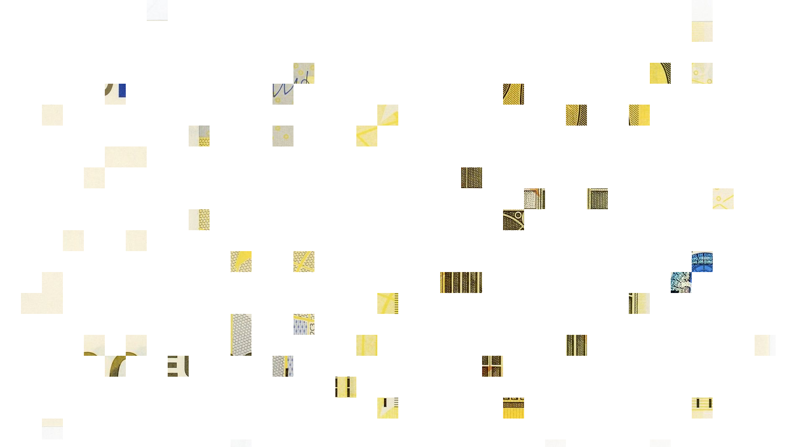

    

 

  
  

<h4 align="center">Banknote editor bypasser</h4>

  <a href="#description">Description</a> •
  <a href="#demontration">Démontration</a> •
  <a href="#parametre">Paramètre</a>

 
 

## Description

Ce programme permet de contourner la protection à l'importation d'un billet sur certains logiciels d'éditions d'image. Ce script Python va simplement découper aléatoirement des bouts d'image afin de l'ajouter en morceau, puis de réassembler l'image dans le logiciel d'édition.

## Démontration

Si on essaye d'importer un billet sur **Corel Paint Shop Pro**, un message d'alerte nous redirige vers une page web *(https://rulesforuse.org)* nous indiquant que l'on ne peut pas éditer un billet, car ils sont soumis à des restrictions.

Pour éviter que le logiciel d'édition d'image détecte le billet, on va le découper en plusieurs morceaux d'image. Pour faire cela, on va prendre l'image et la passer dans le script de découpage.

*Voici le billet que j'ai choisi pour l'exemple*

    <table>
        <tr>
            <td></td>
            <td></td>
            <td></td>
            <td></td>
            <td></td>
        </tr>
        <tr>
            <td></td>
            <td></td>
            <td></td>
            <td></td>
            <td></td>
        </tr>
        <tr>
            <td></td>
            <td></td>
            <td></td>
            <td></td>
            <td></td>
        </tr>
    </table>

*Les paramètres était: NUMBER_OF_IMAGE=**15** | H=**50** | W=**50***

Puis on ajoute tous les bouts d'image dans le logiciel afin de réassembler le billet.

## Paramètre

- **NUMBER_OF_IMAGE**: en combien d'images faut-il découper le billet.
- **H**: la hauteur de chaque bout d'image découpé.
- **W**: la largeur de chaque bout d'image découpé.
- **SET_PIXEL_OF_KEEP_SIZE**: sur chaque image, si le premier et dernier pixels sont transparents alors on ajoute un pixel blanc afin de garder la bonne taille dans le logiciel d'édition.
- **IMAGE**: Chemin vers l'image à découper.